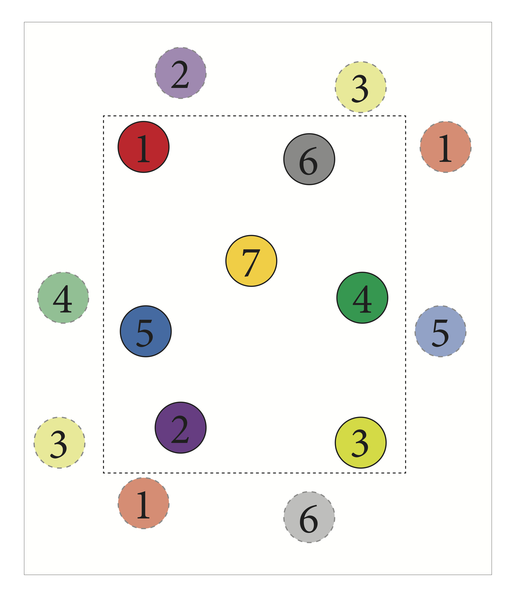

.. _neighbors:

=================
Finding Neighbors
=================

Now that you've been introduced to the basics of interacting with **freud**, let's dive into the central feature of **freud**: efficiently and flexibly finding neighbors in periodic systems.

Problem Statement
=================

Neighbor-Based Calculations
---------------------------
As discussed in :ref:`the previous section <computeclass>`, a central task in many of the computations in **freud** is finding particles' neighbors.
These calculations typically only involve a limited subset of a particle's neighbors that are defined as characterizing its local environment.
This requirement is analogous to the force calculations typically performed in molecular dynamics simulations, where a cutoff radius is specified beyond which pair forces are assumed to be small enough to neglect.
Unlike in simulation, though, many analyses call for different specifications than simply selecting all points within a certain distance.

An important example is the calculation of order parameters, which can help characterize phase transitions.
Such parameters can be highly sensitive to the precise way in which neighbors are selected.
For instance, if a hard distance cutoff is imposed in finding neighbors for the hexatic order parameter, a particle may only be found to have five neighbors when it actually has six neighbors except the last particle is slightly outside the cutoff radius.
To accomodate such differences in a flexible manner, **freud** allows users to specify neighbors in a variety of ways.

Finding Periodic Neighbors
--------------------------

Finding neighbors in periodic systems is significantly more challenging than in aperiodic systems.
To illustrate the difference, consider the figure above, where the black dashed line indicates the boundaries of the system.
If this system were aperiodic, the three nearest neighbors for point 1 would be points 5, 6, and 7.
However, due to periodicity, point 2 is actually closer to point 1 than any of the others if you consider moving straight through the top (or equivalently, the bottom) boundary.
Although many tools provide efficient implementations of algorithms for finding neighbors in aperiodic systems, they seldom generalize to periodic systems.
Even more rare is the ability to work not just in *cubic* periodic systems, which are relatively tractable, but in arbitrary triclinic geometries as described in :ref:`pbcs`.
This is precisely the type of calculation **freud** is designed for.

Neighbor Querying
=================

To understand how ``Compute classes`` find neighbors in **freud**, it helps to start by learning about **freud**'s neighbor finding classes directly.
Note that much more detail on this topic is available in the :ref:`querying` topic guide; in this section we will restrict ourselves to a higher-level overview.
For our demonstration, we will make use of the :class:`freud.locality.AABBQuery` class, which implements one fast method for periodic neighbor finding.
The primary mode of interfacing with this class (and other neighbor finding classes) is through the :meth:`query <freud.locality.AABBQuery>` interface.

.. code-block:: python

    import numpy as np
    import freud

    # As an example, we randomly generate 100 points in a 10x10x10 cubic box.
    L = 10
    num_points = 100

    # We shift all points into the expected range for freud.
    points = np.random.rand(num_points)*L - L/2
    box = freud.box.Box.cube(L)
    aq = freud.locality.AABBQuery(box, points)

    # Now we generate a smaller sample of points for which we want to find
    # neighbors based on the original set.
    query_points = np.random.rand(num_points/10)*L - L/2
    distances = []

    # Here, we ask for the 4 nearest neighbors of each point in query_points.
    for bond in aq.query(query_points, dict(num_neighbors=4)):
        # The returned bonds are tuples of the form
        # (query_point_index, point_index, distance). For instance, a bond
        # (1, 3, 0.2) would indicate that points[3] was one of the 4 nearest
        # neighbors for query_points[1], and that they are separated by a
        # distance of 0.2
        # (i.e. np.linalg.norm(query_points[1] - points[3]) == 2).
        distances.append(bond[2])

    avg_distance = np.mean(distances)

Let's dig into this script a little bit.
Our first step is creating a set of 100 points in a cubic box.
Note that the shifting done in the code above could also be accomplished using the :meth:`Box.wrap <freud.box.Box.wrap>` method like so: ``box.wrap(np.random.rand(num_points)*L)``.
The result would appear different, because if plotted without considering periodicity, the points would range from :code:`-L/2` to :code:`L/2` rather than from 0 to :code:`L`.
However, these two sets of points would be equivalent in a periodic system.

We then generate an additional set of ``query_points`` and ask for neighbors using the :meth:`query <freud.locality.AABBQuery>` method.
This function accepts two arguments: a set of points, and a :class:`dict` of **query arguments**.
Query arguments are a central concept in **freud** and represent a complete specification of the set of neighbors to be found.
In general, the most common forms of queries are those requesting either a fixed number of neighbors, as in the example above, or those requesting all neighbors within a specific distance.
For example, if we wanted to rerun the above example but instead find all bonds of length less than or equal to 2, we would simply replace the for loop above with:

.. code-block:: python

    for bond in aq.query(query_points, dict(r_max=2)):
        distances.append(bond[2])

Query arguments constitute a powerful method for specifying a query request.
Many query arguments may be combined for more specific purposes.
A common use-case is finding all neighbors within a single set of points (i.e. setting ``query_points = points`` in the above example).
In this situation, however, it is typically not useful for a point to find itself as a neighbor since it is trivially the closest point to itself and falls within any cutoff radius.
To avoid this, we can use the ``exclude_ii`` query argument:

.. code-block:: python

    query_points = points
    for bond in aq.query(query_points, dict(num_neighbors=4, exclude_ii=True)):
        pass

The above example will find the 4 nearest neighbors to each point, excepting the point itself.
A complete description of valid query arguments can be found in :ref:`querying`.

Neighbor Lists
==============

Query arguments provide a simple but powerful language with which to express neighbor finding logic.
Used in the manner shown above, :meth:`query <freud.locality.AABBQuery>` can be used to express many calculations in a very natural, Pythonic way.
By itself, though, the API shown above is somewhat restrictive because the output of :meth:`query <freud.locality.AABBQuery>` is a `generator <https://docs.python.org/3/glossary.html#term-generator>`_.
If you aren't familiar with generators, the important thing to know is that they can be looped over, *but only once*.
Unlike objects like lists, which you can loop over as many times as you like, once you've looped over a generator once, you can't start again from the beginning.

In the examples above, this wasn't a problem because we simply iterated over the bonds once for a single calculation.
However, in many practical cases we may need to reuse the set of neighbors multiple times.
A simple solution would be to simply to store the bonds into a list as we loop over them.
However, because this is such a common use-case, **freud** provides its own containers for bonds: the :class:`freud.locality.NeighborList`.

Queries can easily be used to generate :class:`NeighborList <freud.locality.NeighborList>` objects using their :meth:`toNeighborList <freud.locality.NeighborQueryResult.toNeighborList>` method:

.. code-block:: python

    query_result = aq.query(query_points, dict(num_neighbors=4, exclude_ii))
    nlist = query_result.toNeighborList()

The resulting object provides a persistent container for bond data.
Using :class:`NeighborLists <freud.locality.NeighborList>`, our original example might instead look like this:

.. code-block:: python

    import numpy as np
    import freud

    L = 10
    num_points = 100

    points = np.random.rand(num_points)*L - L/2
    box = freud.box.Box.cube(L)
    aq = freud.locality.AABBQuery(box, points)

    query_points = np.random.rand(num_points/10)*L - L/2
    distances = []

    # Here, we ask for the 4 nearest neighbors of each point in query_points.
    query_result = aq.query(query_points, dict(num_neighbors=4)):
    nlist = query_result.toNeighborList()
    for (i, j) in nlist:
        # Note that we have to wrap the bond vector before taking the norm;
        # this is the simplest way to compute distances in a periodic system.
        distances.append(np.linalg.norm(box.wrap(query_points[i] - points[j])))

    avg_distance = np.mean(distances)

Note that in the above example we looped directly over the ``nlist`` and recomputed distances.
However, the ``query_result`` contained information about distances: here's how we access that through the ``nlist``:

.. code-block:: python

    assert np.all(nlist.distances == distances)

The indices are also accessible through properties, or through a NumPy-like slicing interface:

.. code-block:: python

    assert np.all(nlist.query_point_indices == nlist[:, 0])
    assert np.all(nlist.point_indices == nlist[:, 1])

Note that the ``query_points`` are always in the first column, while the ``points`` are in the second column.
:class:`freud.locality.NeighborList` objects also store other properties; for instance, they may assign different weights to different bonds.
This feature can be used by, for example, :class:`freud.order.Steinhardt`, which is typically used for calculating `Steinhardt order parameters <https://journals.aps.org/prb/abstract/10.1103/PhysRevB.28.784>`_, a standard tool for characterizing crystalline order.
When provided appropriately weighted neighbors, however, the class instead computes `Minkowski structure metrics <https://iopscience.iop.org/article/10.1088/1367-2630/15/8/083028/meta>`_, which are much more sensitive measures that can differentiate a wider array of crystal structures.
